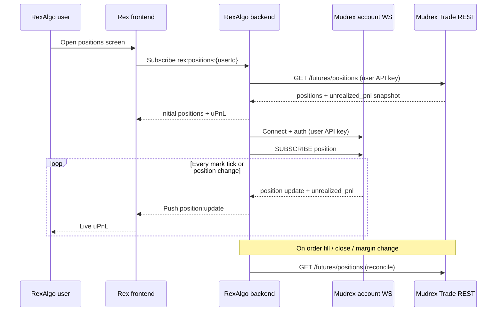

# RexAlgo × Mudrex — Streaming Unrealized PnL Solution

**Goal:** RexAlgo users see open positions in Rex with **live unrealized PnL that matches Mudrex exactly** (same value as Mudrex app / liquidation logic). Rex is the **source of truth** for the user experience.

**Constraint today:** Mudrex Trade API returns position state but **no `unrealized_pnl`**. Public Price WebSocket has mark (`mp`) but **no position data**. Client-side math **cannot be guaranteed** to match Mudrex UI (INR hedge, rounding, funding treatment).

**Related:** [`unrealized-pnl-price-websocket-strategy.md`](unrealized-pnl-price-websocket-strategy.md)

---

## Summary

| Party | Build |
|---|---|
| **Mudrex** | Server-computed `unrealized_pnl` on positions + **authenticated account WebSocket** that streams it |
| **RexAlgo** | Position cache per user + subscribe to Mudrex account WS + **fan-out to Rex users** via Rex WS |

**Do not** rely on Price WS + client formula if Rex must match Mudrex to the cent.

---

## Target architecture



---

## What Mudrex must build

### 1. Server-computed `unrealized_pnl` (required)

Add to **open position** responses — same formula and rounding as Mudrex app.

#### REST — extend `GET /fapi/v1/futures/positions`

```json
{
    "success": true,
    "data": [
        {
            "id": "019ecc52-2f95-7ab5-8682-c3a0f43ccda6",
            "symbol": "BTCUSDT",
            "order_type": "LONG",
            "entry_price": "63000",
            "quantity": "0.1",
            "trade_currency": "USDT",
            "status": "OPEN",
            "mark_price": "63694.2",
            "unrealized_pnl": "69.42",
            "unrealized_pnl_perc": "1.10",
            "computed_at": 1781935200
        }
    ]
}
```

| New field | Type | Description |
|---|---|---|
| `mark_price` | string | Mark used for this uPnL (USDT) |
| `unrealized_pnl` | string | **Authoritative** — in `trade_currency` |
| `unrealized_pnl_perc` | string | Optional — vs initial margin or notional |
| `computed_at` | integer | Unix seconds when Mudrex computed the value |

**Rules:**
- Same computation as Mudrex mobile/web open positions screen
- INR positions: use same hedge rules as app (`entry_hedge_rate` vs live — **document which**)
- Recompute on every internal mark tick, not only on REST poll

#### INR example

```json
{
    "symbol": "SOMIUSDT",
    "order_type": "LONG",
    "entry_price": "0.11442",
    "quantity": "43.8",
    "trade_currency": "INR",
    "entry_hedge_rate": "96",
    "mark_price": "0.11510",
    "unrealized_pnl": "28.64",
    "computed_at": 1781935200
}
```

---

### 2. Authenticated account WebSocket (required for streaming)

Public Price WS (`price.mudrex.com`) is **not sufficient** — it has no user context.

#### Proposed endpoint

```
wss://trade.mudrex.com/fapi/v1/ws
```

(or sibling — engineering choice; **must be on Trade**, authenticated)

#### Auth

- API key at handshake or first message (same `X-Authentication` secret)
- One connection per API key (document limit, e.g. 3 concurrent)

#### Subscribe — position stream

**Request:**

```json
{
    "id": 1,
    "method": "SUBSCRIBE",
    "params": ["position"]
}
```

Optional filter:

```json
{
    "id": 1,
    "method": "SUBSCRIBE",
    "params": ["position"],
    "trade_currency": "USDT"
}
```

#### Push — on mark move or position state change

```json
{
    "stream": "position",
    "data": {
        "event": "UPNL_UPDATE",
        "id": "019ecc52-2f95-7ab5-8682-c3a0f43ccda6",
        "symbol": "BTCUSDT",
        "order_type": "LONG",
        "quantity": "0.1",
        "entry_price": "63000",
        "trade_currency": "USDT",
        "mark_price": "63698.0",
        "unrealized_pnl": "69.80",
        "computed_at": 1781935205
    }
}
```

| `event` | When |
|---|---|
| `SNAPSHOT` | First message after subscribe — all open positions |
| `UPNL_UPDATE` | Mark moved — uPnL recalculated |
| `POSITION_OPENED` | New position |
| `POSITION_CHANGED` | Quantity, margin, leverage, SL/TP change |
| `POSITION_CLOSED` | Position gone — remove from UI |

**Push frequency:** At least every mark tick for symbols with open positions (align with internal mark engine — typically 1s or on `ticker@5s` cadence).

#### Why not extend public Price WS?

| Issue | Reason |
|---|---|
| No user identity | Price WS is public |
| No position size | Rex would still client-compute → drift from Mudrex |
| Multi-tenant | Rex has thousands of users — cannot mix private data on public socket |

Price WS remains for **charts/signals**. Account WS is for **position + uPnL**.

---

### 3. MVP shortcut (if account WS is delayed)

Ship REST fields first; Rex polls until WS exists.

| Phase | Mudrex delivers | Streaming quality |
|---|---|---|
| **MVP** | `unrealized_pnl` on `GET /positions` only | Rex polls 1–2s → good enough for beta |
| **Target** | Account WS `position` topic | True push, low latency |

**MVP is not the end state** for Rex if they brand uPnL as Mudrex-official.

---

### 4. Mudrex engineering checklist

- [ ] Implement `unrealized_pnl` in position service (single source of truth with app)
- [ ] Expose on `GET /futures/positions` (+ single position if exists)
- [ ] Document formula + INR hedge rules in API docs
- [ ] Build authenticated account WebSocket
- [ ] `position` topic with `SNAPSHOT` + `UPNL_UPDATE` events
- [ ] Push on: mark tick, open, close, partial close, add margin, leverage change
- [ ] Rate limits: connections per API key, messages/sec
- [ ] Close connection on API key revoke (PRD edge case)
- [ ] Integration test: RexAlgo can match Mudrex app uPnL on BTCUSDT LONG for 60s

---

## What RexAlgo must build

### 1. Per-user Mudrex session

Each Rex user links a **Mudrex API key**. Rex stores encrypted key server-side.

```
Rex user ──1:1── Mudrex API key ── positions + uPnL
```

Never expose Mudrex secret to Rex frontend.

---

### 2. Position sync service (Rex backend)

| Trigger | Action |
|---|---|
| User opens Rex positions page | `GET /futures/positions` (USDT + INR if needed) |
| User places/closes via Rex | Refresh immediately after order response |
| Mudrex WS `POSITION_*` event | Merge into Rex cache |
| Periodic reconcile | Every 60s `GET /positions` as safety net |
| WS disconnect | Poll `GET /positions` every 2s until WS back |

**Rex cache model (per user):**

```json
{
    "userId": "rex-user-123",
    "positions": [
        {
            "mudrex_position_id": "019ecc52-2f95-7ab5-8682-c3a0f43ccda6",
            "symbol": "BTCUSDT",
            "side": "LONG",
            "quantity": "0.1",
            "entry_price": "63000",
            "trade_currency": "USDT",
            "mark_price": "63694.2",
            "unrealized_pnl": "69.42",
            "computed_at": 1781935200,
            "source": "mudrex"
        }
    ]
}
```

**Rule:** Always display `unrealized_pnl` from Mudrex payload — **never recalculate** in Rex.

---

### 3. Mudrex connection manager (Rex backend)

For each **active** Rex user with open positions (or on positions page):

```
1. Open wss://trade.mudrex.com/fapi/v1/ws with user's API key
2. SUBSCRIBE position
3. On UPNL_UPDATE → update cache → fan-out to Rex UI
4. On disconnect → exponential backoff reconnect + resubscribe
5. Idle users → close Mudrex WS after N minutes (save connections)
```

**Scale:** 1 Mudrex WS per Rex user with live positions — plan connection pool and idle teardown.

---

### 4. Rex → user streaming layer

Rex frontend should **not** call Mudrex directly. Rex backend fans out:

```
Rex WS channel: rex:positions:{userId}

Message:
{
    "type": "position.upnl",
    "position_id": "019ecc52-2f95-7ab5-8682-c3a0f43ccda6",
    "symbol": "BTCUSDT",
    "unrealized_pnl": "69.80",
    "mark_price": "63698.0",
    "computed_at": 1781935205
}
```

| Rex UI state | Source |
|---|---|
| Position list (static fields) | Initial REST snapshot |
| uPnL column (animated) | Mudrex WS → Rex relay |
| Closed position | `POSITION_CLOSED` → remove row |

---

### 5. RexAlgo checklist

- [ ] Secure Mudrex API key storage per user
- [ ] Position sync on page load + post-trade
- [ ] Mudrex account WS client (auth, subscribe, reconnect)
- [ ] Cache keyed by `mudrex_position_id`
- [ ] Rex WS fan-out to frontend
- [ ] Handle USDT and INR positions (`trade_currency` filter or two calls)
- [ ] Show `computed_at` or “live” indicator optional
- [ ] Reconcile job if WS missed an event
- [ ] **Do not** compute uPnL from Price WS `mp` in production
- [ ] QA: compare Rex uPnL vs Mudrex app for same position for 5 minutes

---

## Phase plan

| Phase | Mudrex | RexAlgo | User experience |
|---|---|---|---|
| **0 (today)** | Positions without uPnL | ❌ Cannot show accurate live uPnL | Stale or wrong |
| **1 MVP** | REST `unrealized_pnl` on positions | Poll 1–2s + Rex WS fan-out | Near-live, Mudrex-correct |
| **2 Target** | Account WS `position` stream | Subscribe + fan-out | True streaming, Mudrex-correct |
| **3 Optional** | WS `wallet` topic | Margin available in Rex | Full portfolio view |

---

## What NOT to do

| Anti-pattern | Why |
|---|---|
| Rex computes uPnL from Price WS `mp` | Will drift from Mudrex app |
| Rex polls only `entry_price` + public mark | Not Mudrex-official |
| Rex exposes Mudrex API key to browser | Security |
| Single global Price WS for all users' uPnL | No per-user position state |
| Document client formula as “official uPnL” | Rex requirement is Mudrex parity |

---

## Open questions for Mudrex (block Rex launch)

1. **Exact parity:** Confirm `unrealized_pnl` on API equals app screen — including INR hedge and decimal places.
2. **Funding:** Is accrued funding included in displayed uPnL or separate? Rex needs one rule.
3. **WS timeline:** Can REST fields ship before account WS? (Rex can start phase 1.)
4. **Connection limits:** Max account WS connections per API key? Rex needs this for scale planning.
5. **Multi-currency:** One WS subscription for all positions or per `trade_currency`?

---

## Decision record

| Question | Answer for Rex |
|---|---|
| Separate uPnL WebSocket? | **No** — use account WS `position` topic |
| Use public Price WS for uPnL? | **No** — charts only |
| Who computes uPnL? | **Mudrex server only** |
| Who streams to end user? | **RexAlgo** (relay Mudrex → Rex UI) |
